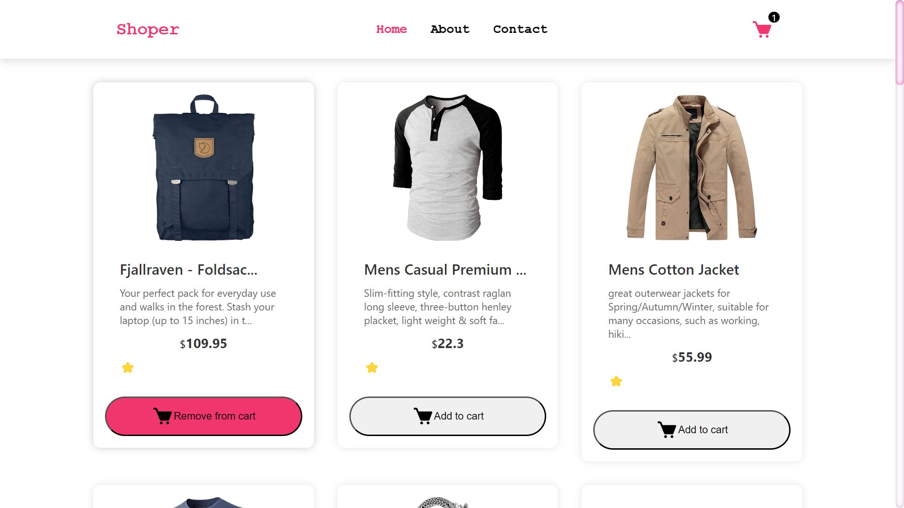
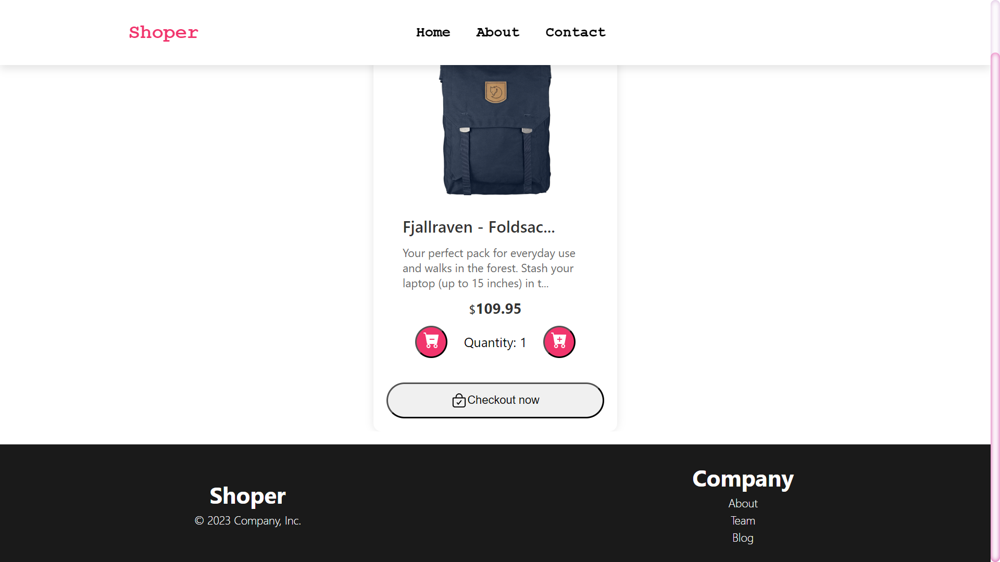

# Shoper -A Simple Shopping App

## Description

This is a simple shopping app that allows users to add items to a cart and checkout. It is built with React, Redux, and React Router. It also uses the [Fake Store API](https://fakestoreapi.com/) to fetch products.

## Installation

To install this project, clone the repository and use npm to install the dependencies.

```bash
  git clone
  cd Shoper_app
  npm install
  yarn start or npm start
```

## Demo

[Live Demo](https://shoper-app.netlify.app/)

## Screenshots

## 



---

## Tech Stack

**Client:** React, Redux, React Router

**Server:** Fake Store API

## Authors

-  Made with 💖 by [@7hourspg](https://github.com/7hourspg)
